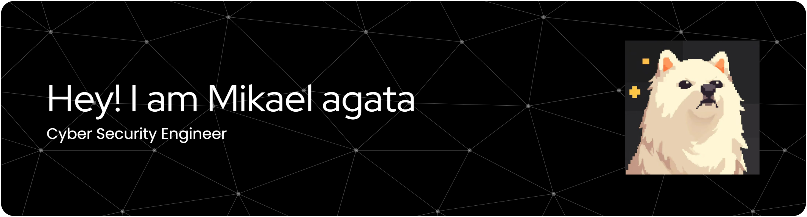

Pelajar SMK RPL | yang berkeinginan kuliah di jepang
Fokus Cybersecurity namun sedikit mengulik mengenai Software  
Juga explore desain, seperti figma dan canva 

### Skills

  
  
  
  
  
  
  
  
  
  

<!--  -->

### My Github stats

  
   
  

  

<picture>
  <source media="(prefers-color-scheme: dark)" srcset="https://raw.githubusercontent.com/MIKAgata/MIKAgata/output/pacman-contribution-graph-dark.svg">
  <source media="(prefers-color-scheme: light)" srcset="https://raw.githubusercontent.com/MIKAgata/MIKAgata/output/pacman-contribution-graph.svg">
  
</picture>

<!-- <picture>
  <source media="(prefers-color-scheme: dark)" srcset="https://raw.githubusercontent.com/MIKAgata/MIKAgata/output/pacman-contribution-graph-dark.svg">
  <source media="(prefers-color-scheme: light)" srcset="https://raw.githubusercontent.com/MIKAgata/MIKAgata/output/pacman-contribution-graph.svg">
  
</picture> -->

### Find me

  
  
  

  

